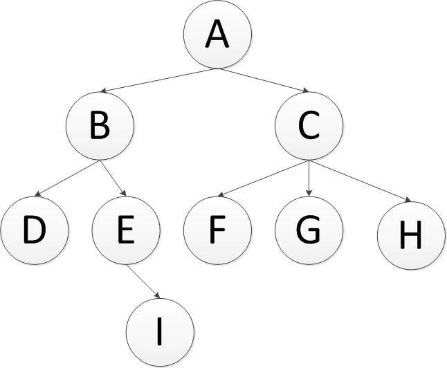

# 【Graph】深度优先遍历(DFS)和广度优先遍历(BFS)



## 一、深度优先

英文缩写为DFS即Depth First Search。

其过程简要来说是对每一个可能的分支路径深入到不能再深入为止，而且每个节点只能访问一次。对于上图中来说深度优先遍历的结果就是：A,B,D,E,I,C,F,G,H.(假设先走子节点的的左侧)。

深度优先遍历各个节点，需要使用到堆（Stack）这种数据结构。stack的特点是是先进后出。整个遍历过程如下：

* 首先将A节点压入堆中，stack（A）;
* 将A节点弹出，同时将A的子节点C，B压入堆中，此时B在堆的顶部，stack(B,C)；
* 将B节点弹出，同时将B的子节点E，D压入堆中，此时D在堆的顶部，stack（D,E,C）；
* 将D节点弹出，没有子节点压入,此时E在堆的顶部，stack（E，C）；
* 将E节点弹出，同时将E的子节点I压入，stack（I,C）；
* ...依次往下，最终遍历完成

代码实现如下：

```java
private void depthFirstSearch(TreeNode nodeHead) {
    if (nodeHead == null) {
        return;
    }
    Stack<TreeNode> stack = new Stack<>();
    stack.push(nodeHead);
    while (!stack.isEmpty()) {
        // 弹出栈顶元素
        TreeNode node = stack.pop();
        System.out.print(node.data + " ");
        // 深度优先遍历，先遍历左边，后遍历右边,栈先进后出
        if (node.rightNode != null) {
            stack.push(node.rightNode);
        }
        if (node.leftNode != null) {
            stack.push(node.leftNode);
        }
    }
}
```

## 二、广度优先

英文缩写为 BFS 即Breadth FirstSearch。

其过程检验来说是对每一层节点依次访问，访问完一层进入下一层，而且每个节点只能访问一次。对于上面的例子来说，广度优先遍历的结果是A,B,C,D,E,F,G,H,I(假设每层节点从左到右访问)。

广度优先遍历各个节点，需要使用到队列（Queue）这种数据结构，queue的特点是先进先出，其实也可以使用双端队列，区别就是双端队列首位都可以插入和弹出节点。整个遍历过程如下：

* 首先将A节点插入队列中，queue（A）;
* 将A节点弹出，同时将A的子节点B，C插入队列中，此时B在队列首，C在队列尾部，queue（B，C）；
* 将B节点弹出，同时将B的子节点D，E插入队列中，此时C在队列首，E在队列尾部，queue（C，D，E）;
* 将C节点弹出，同时将C的子节点F，G，H插入队列中，此时D在队列首，H在队列尾部，queue（D，E，F，G，H）；
* 将D节点弹出，D没有子节点，此时E在队列首，H在队列尾部，queue（E，F，G，H）；
* ...依次往下，最终遍历完成

```java
private void broadFirstSearch(TreeNode nodeHead) {
    if (nodeHead == null) {
        return;
    }

    Queue<TreeNode> queue = new ArrayDeque<>();
    queue.offer(nodeHead);

    while (!queue.isEmpty()) {
        TreeNode node = queue.poll();
        System.out.print(node.data + " ");
        // 广度优先遍历，在这里采用每一行从左到右遍历
        if (node.leftNode != null) {
            queue.offer(node.leftNode);
        }
        if (node.rightNode != null) {
            queue.offer(node.rightNode);
        }
    }
}
```