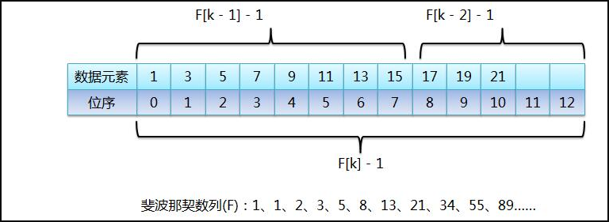

# 【Search】斐波那契查找

[TOC]

## 一、算法介绍

斐波那契数列，又称黄金分割数列，指的是这样一个数列：1、1、2、3、5、8、13、21、····，在数学上，斐波那契被递归方法如下定义：F(1)=1，F(2)=1，F(n)=f(n-1)+F(n-2) （n>=2）。该数列越往后相邻的两个数的比值越趋向于黄金比例值（0.618）。

 斐波那契查找就是在二分查找的基础上根据斐波那契数列进行分割的。

## 二、斐波那契思想

在斐波那契数列找一个等于略大于查找表中元素个数的数F[n]，将原查找表扩展为长度为F[n]，如果要补充元素，则补充重复最后一个元素，直到满足F[n]个元素，完成后进行斐波那契分割，即F[n]个元素分割为前半部分F[n-1]个元素，后半部分F[n-2]个元素，找出要查找的元素在那一部分并递归，直到找到。



斐波那契思想与二分法相类似，不过中间点不再是中点，而变成了黄金分割点的附近mid=low+F(k-1)-1：

1. F代表的斐波那契数列
2. k代表斐波那契数列的第k个元素
3. 由F[k]=F[k-1]+F[k-2]可以得知，可以得到F[k]-1=(F[k-1]-1)+(F[k-2]-1)+1,这个式子说明只要是顺序表的长度为F[k]-1，就可以分为(F[k-1]-1)和(F[k-2]-1)两段，另外一个1就是mid位置的元素
4. 类似的每一个子段也可以用同样的方式来进行分隔
5. 但是顺序表的长度不一定是恰好等于F[k]-1,所以需要将原来的顺序表的长度增加到F[k]-1,这里的k值仅仅需要恰好使得F[k]-1恰好大于或者等于n,新增位置，都赋值为下标为n-1位置的值就可以了

对于 **n=F(k)-1 ，顺序表中记录的个数为某个斐波那契数小1**的理解：是为了统一格式，以方便递归或者循环程序的编写。表中的数据是F(k)-1个，使用mid值进行分割又用掉一个，那么剩下F(k)-2个。正好分给两个子序列，每个子序列的个数分别是F(k-1)-1与F(k-2)-1个，格式上与之前是统一的，否则，每个子序列的元素个数有可能是F(k-1)，F(k-1)-1，F(k-2)，F(k-2)-1个，写程序会非常麻烦。（或者说标识每次取斐波那契数列中的某个值时(F[k])，都会进行-1操作，这是因为有序表数组位序从0开始的，纯粹是为了迎合位序从0开始。）

## 三、代码实现

```java
public class FibonacciSearch {

    // 斐波那契数组的长度
    private static final int MAXSIZE = 20;

    public static void main(String[] args) {
        int[] arr = new int[]{1, 2, 3, 4, 5, 5, 6, 6, 7};
        FibonacciSearch search = new FibonacciSearch();
        System.out.println(search.fibonacciSearch(arr, 3));
        System.out.println(search.fibonacciSearch(arr, 5));
    }

    private int fibonacciSearch(int[] arr, int key) {

        int low = 0;
        int high = arr.length - 1;

        // 获取斐波那契数列
        int[] f = fibonacci();
        // 斐波那契分割数值下标
        int k = 0;
        // 获取斐波那契分割数值下标
        while (arr.length > f[k] - 1) {
            k++;
        }

        // 创建临时数组
        // 因为f[k]这个值可能大于数组 arr 的长度，因此需要使用Arrays类，构造一个新的数组并指向a
        // 不足的部分会使用0填充
        int[] temp = Arrays.copyOf(arr, f[k]);

        // 序列补充至f[k]个元素
        // 补充的元素值为最后一个元素的值
        for (int i = arr.length; i < f[k] - 1; i++) {
            temp[i] = temp[high];
        }

        while (low <= high) {
            // 前半部分有f[k-1]个元素，由于下标从0开始
            // 则-1 获取 黄金分割位置元素的下标
            int mid = low + f[k - 1] - 1;
            if (key < temp[mid]) {
                // 查找前半部分
                high = mid - 1;
                // 全部元素= 前面的元素 + 后面的元素
                // f[k] = f[k-1] + f[k-2]
                // 因为前半部分有 f[k-1] 个元素，所以 k = k-1
                k = k - 1;
            } else if (key > arr[mid]) {
                // 查找后半部分
                low = mid + 1;
                // 全部元素 = 前半部分 + 后半部分
                // f[k] = f[k-1] + f[k-2]
                // 因为后半部分有f[k-2]个元素，所以 k = k-2
                k = k - 2;
            } else {
                // 如果为真则找到相应的位置
                if (mid <= high) {
                    return mid;
                } else {
                    // 出现这种情况是查找到补充的元素
                    // 而补充的元素与high位置的元素一样
                    return high;
                }
            }
        }

        return -1;

    }

    /**
     * 斐波那契数列
     */
    private int[] fibonacci() {
        int[] f = new int[MAXSIZE];
        int i = 0;
        f[0] = 1;
        f[1] = 1;
        for (i = 2; i < MAXSIZE; i++) {
            f[i] = f[i - 1] + f[i - 2];
        }
        return f;
    }


}
```

## 四、复杂度分析

斐波那契查找算法的核心在于 :
1 ) 当 key=a[mid] 时，查找就成功。
2 ) 当 key<a[mid]时，新范围是第low个到第mid-l个，此时范围个数为f[k-1]-1个;
3 ) 当 key>a[mid]时，新范围是第mid+l个到第high个，此时范围个数为f[k-2]-1个。

也就是说，如果要查找的记录在右侧，则左侧的数据都不用再判断了，不断反复进行下去，对处于当中的大部分数据，其工作效率要高一些。所以尽管斐波那契查找的时间复杂也为O(logn)，但就平均性能来说，斐波那契查找要优于折半查找。可惜如果是最坏情况，比如这里key=l，那么始终都处于左侧长半区在查找，则查找效率要低于折半查找。

还有比较关键的一点，折半查找是进行加法与除法运算mid=(low+ high)/2，插值查找进行复杂的四则运算mid = low + ((key - a[low])/(a[high] - a[low]))(high - low),而斐波那契查找只是最简单加减法运算mid=low+f[k-l]-1，在海量数据的查找过程中，这种细微的差别可能会影响最终的查找效率。

应该说，三种有序表的查找本质上是分隔点的选择不同，各有优劣，实际开发时可根据数据的特点综合考虑再做出选择。

