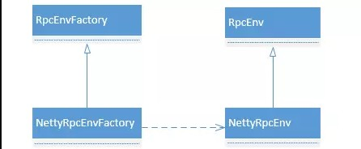
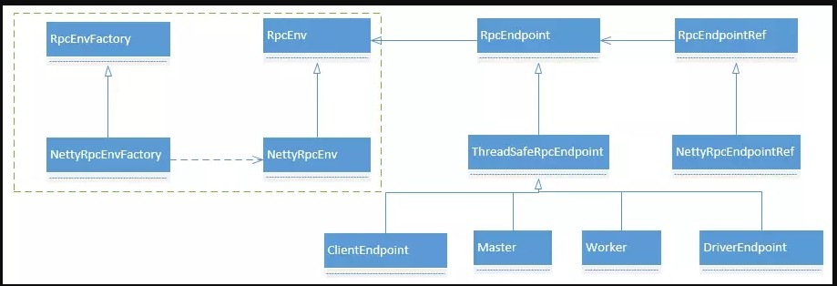
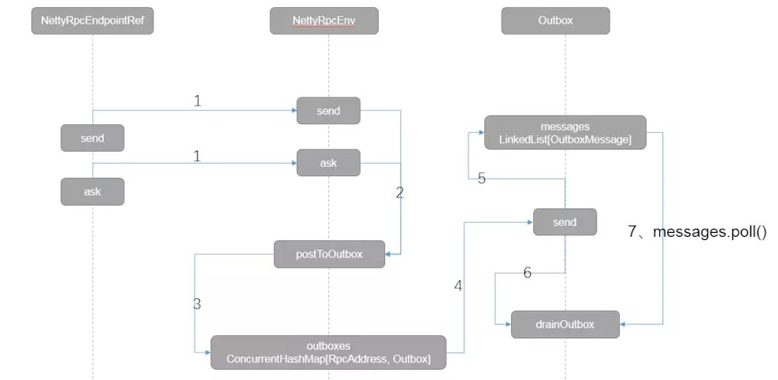

# 【Spark】Spark 消息通信架构

本篇结构：

- 前言
- 几个重要概念
- Spark RpcEnv
- Spark RpcEndpoint
- Spark RpcEndpointRef
- RpcEnv 和 RpcEndpoint 关系类图
- Dispatcher 和 Inbox
- Outbox
- 时序图

## 一、前言

在 Spark 事件总线 一篇中有介绍组件内之间的通信，那 Spark 集群内，各组件之间又是怎么通信的？ Spark 有内置的 RPC 框架（在 Spark 2.0.0 之前，是借助 Akka 来实现的，虽然没有具体用过，但社区评论都赞 Akka 是非常优秀的开源分布式框架。那 Spark 为什么弃用了 Akka？主要原因是解决用户的Spark Application 中 Akka 版本和 Spark 内置的 Akka版本冲突的问题。）用于组件之间通信。

首先要说明，之前也没有玩过 Netty，所以现阶段的分析不会太底层，主要介绍 Spark 的 RPC 框架大致的样子，至于 Spark 的 RPC 框架底层是怎么用 Netty 的，不会在分析范围内。 

水平有限，慢慢成长吧。

## 二、几个重要概念

- RpcEnv：RPC 环境，每个 Rpc 端点运行时依赖的环境称之为 RpcEnv。
- RpcEndpoint：RPC 端点 ，Spark 将每个通信实体都都称之一个Rpc端点，且都实现 RpcEndpoint 接口，内部根据不同端点的需求，设计不同的消息和不同的业务处理。
- Dispatcher：消息分发器，负责将 RpcMessage 分发至对应的 RpcEndpoint。Dispatcher 中包含一个 MessageLoop，它读取 LinkedBlockingQueue 中的投递 RpcMessage，根据客户端指定的 Endpoint 标识，找到 Endpoint 的 Inbox，然后投递进去，由于是阻塞队列，当没有消息的时候自然阻塞，一旦有消息，就开始工作。Dispatcher 的 ThreadPool 负责消费这些 Message。
- Inbox：一个本地端点对应一个收件箱，Inbox 里面有一个 InboxMessage 的链表，InboxMessage 有很多子类，可以是远程调用过来的 RpcMessage，可以是远程调用过来的 fire-and-forget 的单向消息 OneWayMessage，还可以是各种服务启动，链路建立断开等 Message，这些 Message 都会在 Inbox 内部的方法内做模式匹配，调用相应的 RpcEndpoint 的函数。
- Outbox：一个远程端点对应一个发件箱，NettyRpcEnv 中包含一个 ConcurrentHashMap[RpcAddress, Outbox]。当消息放入 Outbox 后，紧接着将消息通过 TransportClient 发送出去。

## 三、Spark RpcEnv

编写 Spark 程序，都是从 SparkContext 开始，在 SparkContext 初始化时，会创通过 createSparkEnv 方法创建 SparkEnv。在创建 SparkEnv 的过程中，有一步是创建 RpcEnv。

```
val systemName = if (isDriver) driverSystemName else executorSystemName
val rpcEnv = RpcEnv.create(systemName, bindAddress, advertiseAddress, port, conf,
  securityManager, clientMode = !isDriver)
```

可以看到 Spark 的通信是从 RpcEnv 开始的。

### 3.1、RpcEnv 的创建

RpcEnv，顾名思义，RPC environment。它是一个抽象类，定义了 Rpc 框架启动、停止和关闭等抽象方法。在其伴生对象 RpcEnv 中，定义了两个 create 方法：

```
  def create(
      name: String,
      host: String,
      port: Int,
      conf: SparkConf,
      securityManager: SecurityManager,
      clientMode: Boolean = false): RpcEnv = {
    create(name, host, host, port, conf, securityManager, clientMode)
  }

  def create(
      name: String,
      bindAddress: String,
      advertiseAddress: String,
      port: Int,
      conf: SparkConf,
      securityManager: SecurityManager,
      clientMode: Boolean): RpcEnv = {
    val config = RpcEnvConfig(conf, name, bindAddress, advertiseAddress, port, securityManager,
      clientMode)
    new NettyRpcEnvFactory().create(config)
  }
```

create() 方法的重心就是通过工厂方法由 RpcEnvFactory 创建 RpcEnv。

RpcEnv 在 Spark 中有一个实现 NettyRpcEnv，RpcEnvFactory 也有一个实现 NettyRpcEnvFactory。典型的工厂模式。



### 3.2、RpcEnv 的启动

来到 NettyRpcEnvFactory 的 create 方法：

```
private[rpc] class NettyRpcEnvFactory extends RpcEnvFactory with Logging {

  def create(config: RpcEnvConfig): RpcEnv = {
    val sparkConf = config.conf
    // Use JavaSerializerInstance in multiple threads is safe. However, if we plan to support
    // KryoSerializer in future, we have to use ThreadLocal to store SerializerInstance
    val javaSerializerInstance =
      new JavaSerializer(sparkConf).newInstance().asInstanceOf[JavaSerializerInstance]
    val nettyEnv =
      new NettyRpcEnv(sparkConf, javaSerializerInstance, config.advertiseAddress,
        config.securityManager)
    if (!config.clientMode) {
      val startNettyRpcEnv: Int => (NettyRpcEnv, Int) = { actualPort =>
        nettyEnv.startServer(config.bindAddress, actualPort)
        (nettyEnv, nettyEnv.address.port)
      }
      try {
        Utils.startServiceOnPort(config.port, startNettyRpcEnv, sparkConf, config.name)._1
      } catch {
        case NonFatal(e) =>
          nettyEnv.shutdown()
          throw e
      }
    }
    nettyEnv
  }
}
```

NettyRpcEnvFactory.create 方法一旦调用就会立即在 bind 的 address 和 port 上启动 server。

这里的 clientMode 参数默认是 false，追踪调用的话在 SparkEnv 中有 clientMode = !isDriver，具体是什么意思，源码中也没有注释，暂时不知怎么回事。

总之默认是会进入 nettyEnv.startServer(config.bindAddress, actualPort) 该方法：

```
  def startServer(bindAddress: String, port: Int): Unit = {
    val bootstraps: java.util.List[TransportServerBootstrap] =
      if (securityManager.isAuthenticationEnabled()) {
        java.util.Arrays.asList(new SaslServerBootstrap(transportConf, securityManager))
      } else {
        java.util.Collections.emptyList()
      }
    server = transportContext.createServer(bindAddress, port, bootstraps)
    dispatcher.registerRpcEndpoint(
      RpcEndpointVerifier.NAME, new RpcEndpointVerifier(this, dispatcher))
  }
```

### 3.3、setupEndpoint

RpcEnv 中要重点关注 setupEndpoint 方法，该方法将 RpcEndpoint 注册到 dispatcher 中，注册时必须指定名称，客户端路由就靠这个名称来找 endpoint。

```
  /**
   * Register a [[RpcEndpoint]] with a name and return its [[RpcEndpointRef]]. [[RpcEnv]] does not
   * guarantee thread-safety.
   */
  def setupEndpoint(name: String, endpoint: RpcEndpoint): RpcEndpointRef
```

Endpoint 是什么？下面介绍。

## 四、Spark RpcEndPoint

有通信的总体框架，还应该有通信的实体，在 Spark 中，RpcEndpoint 是对所有通信实体的抽象。RpcEndpoint 是一个特征，其中定义了一些函数，这些函数在收到消息后被触发。

```
private[spark] trait RpcEndpoint {

  /**
   * The [[RpcEnv]] that this [[RpcEndpoint]] is registered to.
   */
  val rpcEnv: RpcEnv

  /**
   * The [[RpcEndpointRef]] of this [[RpcEndpoint]]. `self` will become valid when `onStart` is
   * called. And `self` will become `null` when `onStop` is called.
   *
   * Note: Because before `onStart`, [[RpcEndpoint]] has not yet been registered and there is not
   * valid [[RpcEndpointRef]] for it. So don't call `self` before `onStart` is called.
   */
  final def self: RpcEndpointRef = {
    require(rpcEnv != null, "rpcEnv has not been initialized")
    rpcEnv.endpointRef(this)
  }

  /**
   * Process messages from [[RpcEndpointRef.send]] or [[RpcCallContext.reply)]]. If receiving a
   * unmatched message, [[SparkException]] will be thrown and sent to `onError`.
   */
  def receive: PartialFunction[Any, Unit] = {
    case _ => throw new SparkException(self + " does not implement 'receive'")
  }

  /**
   * Process messages from [[RpcEndpointRef.ask]]. If receiving a unmatched message,
   * [[SparkException]] will be thrown and sent to `onError`.
   */
  def receiveAndReply(context: RpcCallContext): PartialFunction[Any, Unit] = {
    case _ => context.sendFailure(new SparkException(self + " won't reply anything"))
  }

  /**
   * Invoked when any exception is thrown during handling messages.
   */
  def onError(cause: Throwable): Unit = {
    // By default, throw e and let RpcEnv handle it
    throw cause
  }

  /**
   * Invoked when `remoteAddress` is connected to the current node.
   */
  def onConnected(remoteAddress: RpcAddress): Unit = {
    // By default, do nothing.
  }

  /**
   * Invoked when `remoteAddress` is lost.
   */
  def onDisconnected(remoteAddress: RpcAddress): Unit = {
    // By default, do nothing.
  }

  /**
   * Invoked when some network error happens in the connection between the current node and
   * `remoteAddress`.
   */
  def onNetworkError(cause: Throwable, remoteAddress: RpcAddress): Unit = {
    // By default, do nothing.
  }

  /**
   * Invoked before [[RpcEndpoint]] starts to handle any message.
   */
  def onStart(): Unit = {
    // By default, do nothing.
  }

  /**
   * Invoked when [[RpcEndpoint]] is stopping. `self` will be `null` in this method and you cannot
   * use it to send or ask messages.
   */
  def onStop(): Unit = {
    // By default, do nothing.
  }

  /**
   * A convenient method to stop [[RpcEndpoint]].
   */
  final def stop(): Unit = {
    val _self = self
    if (_self != null) {
      rpcEnv.stop(_self)
    }
  }
}
```

### 4.1、RpcEndpoint 方法

- receive：接收消息并处理，但不回复
- receiveAndReply：接收消息处理后，并给客户端回复
- onError：发生异常时，调用
- onConnected：当客户端与当前节点连接上后调用
- onDisconnected：当客户端与当前节点失去连接上后调用
- onNetworkError：当网络连接发生错误进行处理
- onStart：在 RpcEndpoint 处理消息前调用，可以在 RpcEndpoint 正式工作前做一些准备工作
- onStop：在停止 RpcEndpoint 前调用，可以在 RpcEndpoint 结束前做一些收尾工作

### 4.2、RpcEndpoint 继承体系

如图：Master、Worker 等都是 RpcEndpoint，至于每个类具体是什么，这一堆就不一一列举具体是什么，有什么用。等用到了再做介绍（笑哭，其实我也不知道具体是什么呀，后面继续学习）。

## 五、Spark RpcEndpointRef

Spark RpcEndpointRef 是对 RpcEndpoint 的引用，要向远端的一个 RpcEndpoint 发起请求，必须拿到其引用 RpcEndpointRef。

RpcEndpointRef 指定了 ip 和 port，是一个类似 spark://host:port/name 这种的地址。

看看其具体类：

```
private[spark] abstract class RpcEndpointRef(conf: SparkConf)
  extends Serializable with Logging {

  private[this] val maxRetries = RpcUtils.numRetries(conf)
  private[this] val retryWaitMs = RpcUtils.retryWaitMs(conf)
  private[this] val defaultAskTimeout = RpcUtils.askRpcTimeout(conf)

  /**
   * return the address for the [[RpcEndpointRef]]
   */
  def address: RpcAddress

  def name: String

  /**
   * Sends a one-way asynchronous message. Fire-and-forget semantics.
   */
  def send(message: Any): Unit

  /**
   * Send a message to the corresponding [[RpcEndpoint.receiveAndReply)]] and return a [[Future]] to
   * receive the reply within the specified timeout.
   *
   * This method only sends the message once and never retries.
   */
  def ask[T: ClassTag](message: Any, timeout: RpcTimeout): Future[T]

  /**
   * Send a message to the corresponding [[RpcEndpoint.receiveAndReply)]] and return a [[Future]] to
   * receive the reply within a default timeout.
   *
   * This method only sends the message once and never retries.
   */
  def ask[T: ClassTag](message: Any): Future[T] = ask(message, defaultAskTimeout)

  /**
   * Send a message to the corresponding [[RpcEndpoint]] and get its result within a default
   * timeout, or throw a SparkException if this fails even after the default number of retries.
   * The default `timeout` will be used in every trial of calling `sendWithReply`. Because this
   * method retries, the message handling in the receiver side should be idempotent.
   *
   * Note: this is a blocking action which may cost a lot of time,  so don't call it in a message
   * loop of [[RpcEndpoint]].
   *
   * @param message the message to send
   * @tparam T type of the reply message
   * @return the reply message from the corresponding [[RpcEndpoint]]
   */
  def askWithRetry[T: ClassTag](message: Any): T = askWithRetry(message, defaultAskTimeout)

  /**
   * Send a message to the corresponding [[RpcEndpoint.receive]] and get its result within a
   * specified timeout, throw a SparkException if this fails even after the specified number of
   * retries. `timeout` will be used in every trial of calling `sendWithReply`. Because this method
   * retries, the message handling in the receiver side should be idempotent.
   *
   * Note: this is a blocking action which may cost a lot of time, so don't call it in a message
   * loop of [[RpcEndpoint]].
   *
   * @param message the message to send
   * @param timeout the timeout duration
   * @tparam T type of the reply message
   * @return the reply message from the corresponding [[RpcEndpoint]]
   */
  def askWithRetry[T: ClassTag](message: Any, timeout: RpcTimeout): T = {
    // TODO: Consider removing multiple attempts
    var attempts = 0
    var lastException: Exception = null
    while (attempts < maxRetries) {
      attempts += 1
      try {
        val future = ask[T](message, timeout)
        val result = timeout.awaitResult(future)
        if (result == null) {
          throw new SparkException("RpcEndpoint returned null")
        }
        return result
      } catch {
        case ie: InterruptedException => throw ie
        case e: Exception =>
          lastException = e
          logWarning(s"Error sending message [message = $message] in $attempts attempts", e)
      }

      if (attempts < maxRetries) {
        Thread.sleep(retryWaitMs)
      }
    }

    throw new SparkException(
      s"Error sending message [message = $message]", lastException)
  }

}
```

其主要方法：

- address：返回对应的地址
- send：单向异步发送，发送后就忘记，不会有状态记录，也不期望回复
- ask[T: ClassTag](message: Any)：以默认的超时时间，调用 ask[T: ClassTag](message: Any, timeout: RpcTimeout)，并得到一个 T 类型的 reply
- askWithRetry[T: ClassTag](message: Any)：相比 ask[T: ClassTag](message: Any)，多了一个重试次数

## 六、RpcEnv 和 RpcEndpoint 关系类图



对于服务端来说，RpcEnv 是 RpcEndpoint 的运行环境，负责 Endpoint 的整个生命周期管理，它可以注册或Endpoint，解析 TCP 层的数据包并反序列化，封装成 RpcMessage，并且路由请求到指定的 Endpoint，调用业务逻辑代码，如果 Endpoint 需要响应，把返回的对象序列化后通过 TCP 层再传输到远程对端，如果 Endpoint 发生异常，那么调用 RpcCallContext.sendFailure 来把异常发送回去。

对客户端来说，通过 RpcEnv 可以获取 RpcEndpoint 引用，也就是 RpcEndpointRef 的。

RpcEnv 的创建由 RpcEnvFactory 负责，RpcEnvFactory 目前只有一个子类是 NettyRpcEnvFactory。NettyRpcEnvFactory.create 方法一旦调用就会立即在 bind 的 address 和 port 上启动 server。

NettyRpcEnv 由 NettyRpcEnvFactory.create 创建，这是整个Spark core 和 org.apache.spark.spark-network-common 的桥梁。其中核心方法 setupEndpoint 会在 Dispatcher 中注册 Endpoint，setupEndpointRef 会先去调用 RpcEndpointVerifier 尝试验证本地或者远程是否存在某个 endpoint，然后再创建 RpcEndpointRef。

## 七、Dispatcher 和 Inbox

NettyRpcEnv 中包含 Dispatcher，主要针对服务端，帮助路由到正确的 RpcEndpoint，并且调用其业务逻辑。

### 7.1、Dispatcher 中重要的属性

```
  private class EndpointData(
      val name: String,
      val endpoint: RpcEndpoint,
      val ref: NettyRpcEndpointRef) {
    val inbox = new Inbox(ref, endpoint)
  }

  private val endpoints: ConcurrentMap[String, EndpointData] =
    new ConcurrentHashMap[String, EndpointData]
  private val endpointRefs: ConcurrentMap[RpcEndpoint, RpcEndpointRef] =
    new ConcurrentHashMap[RpcEndpoint, RpcEndpointRef]

  // Track the receivers whose inboxes may contain messages.
  private val receivers = new LinkedBlockingQueue[EndpointData]
```

- 类EndpointData：是一个包含 name/RpcEndpoint/RpcEndpointRef/Inbox，这样每个 RpcEndpoint 都有一个 Inbox，用于存放 InboxMessage。
- endpoints：ConcurrentHashMap，维系所有的 name -> EndpointData 的映射。
- endpointRefs：ConcurrentMap，维系所有 RpcEndpoint -> RpcEndpointRef 的映射。
- receivers：LinkedBlockingQueue，维系所有的 EndpointData。

### 7.2、Dispatcher 调度原理

```
  private val threadpool: ThreadPoolExecutor = {
    val numThreads = nettyEnv.conf.getInt("spark.rpc.netty.dispatcher.numThreads",
      math.max(2, Runtime.getRuntime.availableProcessors()))
    val pool = ThreadUtils.newDaemonFixedThreadPool(numThreads, "dispatcher-event-loop")
    for (i <- 0 until numThreads) {
      pool.execute(new MessageLoop)
    }
    pool
  }

  /** Message loop used for dispatching messages. */
  private class MessageLoop extends Runnable {
    override def run(): Unit = {
      try {
        while (true) {
          try {
            val data = receivers.take()
            if (data == PoisonPill) {
              // Put PoisonPill back so that other MessageLoops can see it.
              receivers.offer(PoisonPill)
              return
            }
            data.inbox.process(Dispatcher.this)
          } catch {
            case NonFatal(e) => logError(e.getMessage, e)
          }
        }
      } catch {
        case ie: InterruptedException => // exit
      }
    }
  }
```

在构建 Dispatcher 时会创建一个线程池，线程池数量为 spark.rpc.netty.dispatcher.numThreads 设置的值或者是 math.max(2, Runtime.getRuntime.availableProcessors())。

该线程池循环从 receivers 阻塞队列取出 EndpointData 处理，如果 receivers 中没有 EndpointData，就阻塞。有 EndpointData 就从该 EndpointData 的 Inbox 中取出消息进行消费。

至于 Inbox 中是如何处理的，篇幅有限，就不列了。

### 7.3、Inbox 的消息源

MessageLoop 线程不断消费各个 EndpointData 中 Inbox 中的消息，那这些消息是怎么来的？

- (1) registerRpcEndpoint：注册 RpcEndpoint

```
  def registerRpcEndpoint(name: String, endpoint: RpcEndpoint): NettyRpcEndpointRef = {
    val addr = RpcEndpointAddress(nettyEnv.address, name)
    val endpointRef = new NettyRpcEndpointRef(nettyEnv.conf, addr, nettyEnv)
    synchronized {
      if (stopped) {
        throw new IllegalStateException("RpcEnv has been stopped")
      }
      if (endpoints.putIfAbsent(name, new EndpointData(name, endpoint, endpointRef)) != null) {
        throw new IllegalArgumentException(s"There is already an RpcEndpoint called $name")
      }
      val data = endpoints.get(name)
      endpointRefs.put(data.endpoint, data.ref)
      receivers.offer(data)  // for the OnStart message
    }
    endpointRef
  }
```

注册 Endpoint 时会将 EndpointData 放入 receivers，每次 new EndpointData 时都会创建一个与之对应的 Inbox，在 Inbox 中会将 OnStart 消息加入其 messages 列表，此时 MessageLoop 线程就会消费该消息。

```
  // OnStart should be the first message to process
  inbox.synchronized {
    messages.add(OnStart)
  }
```

- (2) unregisterRpcEndpoint：解注册 RpcEndpoint

```
  // Should be idempotent
  private def unregisterRpcEndpoint(name: String): Unit = {
    val data = endpoints.remove(name)
    if (data != null) {
      data.inbox.stop()
      receivers.offer(data)  // for the OnStop message
    }
    // Don't clean `endpointRefs` here because it's possible that some messages are being processed
    // now and they can use `getRpcEndpointRef`. So `endpointRefs` will be cleaned in Inbox via
    // `removeRpcEndpointRef`.
  }
```

解注册时将 EndpointData 从 endpoints 中移除，之后，inbox 往 messages 发送 OnStop 消息，receivers.offer(data) 后 MessageLoop 线程进行处理。

```
  def stop(): Unit = inbox.synchronized {
    // The following codes should be in `synchronized` so that we can make sure "OnStop" is the last
    // message
    if (!stopped) {
      // We should disable concurrent here. Then when RpcEndpoint.onStop is called, it's the only
      // thread that is processing messages. So `RpcEndpoint.onStop` can release its resources
      // safely.
      enableConcurrent = false
      stopped = true
      messages.add(OnStop)
      // Note: The concurrent events in messages will be processed one by one.
    }
  }
```

- (3) postMessage：将消息提交给指定的 RpcEndpoint

```
  private def postMessage(
      endpointName: String,
      message: InboxMessage,
      callbackIfStopped: (Exception) => Unit): Unit = {
    val error = synchronized {
      val data = endpoints.get(endpointName)
      if (stopped) {
        Some(new RpcEnvStoppedException())
      } else if (data == null) {
        Some(new SparkException(s"Could not find $endpointName."))
      } else {
        data.inbox.post(message)
        receivers.offer(data)
        None
      }
    }
    // We don't need to call `onStop` in the `synchronized` block
    error.foreach(callbackIfStopped)
  }
```

传递消息时首先会将消息投递到该 Endpoint 对应的 Inbox 内，然后 再 receivers.offer(data)，MessageLoop 消费消息。

```
  def post(message: InboxMessage): Unit = inbox.synchronized {
    if (stopped) {
      // We already put "OnStop" into "messages", so we should drop further messages
      onDrop(message)
    } else {
      messages.add(message)
      false
    }
  }
```

- (4) stop：停止 Dispatcher

```
  def stop(): Unit = {
    synchronized {
      if (stopped) {
        return
      }
      stopped = true
    }
    // Stop all endpoints. This will queue all endpoints for processing by the message loops.
    endpoints.keySet().asScala.foreach(unregisterRpcEndpoint)
    // Enqueue a message that tells the message loops to stop.
    receivers.offer(PoisonPill)
    threadpool.shutdown()
  }
```

stop 会调用 unregisterRpcEndpoint 方法，走该方法的逻辑，然后会向 receivers 中投递 PoisonPill 毒药，全都是 null，使 Message 线程停止（这段逻辑可回到 MessageLoop 查看），然后关闭线程池。

### 7.4、Dispatcher 和 Inbox 请求流程图


## 八、Outbox

在 NettyRpcEnv 中有一个 outboxes 字段：

```
  /**
   * A map for [[RpcAddress]] and [[Outbox]]. When we are connecting to a remote [[RpcAddress]],
   * we just put messages to its [[Outbox]] to implement a non-blocking `send` method.
   */
  private val outboxes = new ConcurrentHashMap[RpcAddress, Outbox]()

```

缓存了所有 远端 RpcAddress -> Outbox 的映射，也即是每个远端对应一个 Outbox。

当一个 Endpoint 向远端 Endpoint 发送消息时，会来到 postToOutbox 方法：

```
  private def postToOutbox(receiver: NettyRpcEndpointRef, message: OutboxMessage): Unit = {
    if (receiver.client != null) {
      message.sendWith(receiver.client)
    } else {
      require(receiver.address != null,
        "Cannot send message to client endpoint with no listen address.")
      val targetOutbox = {
        val outbox = outboxes.get(receiver.address)
        if (outbox == null) {
          val newOutbox = new Outbox(this, receiver.address)
          val oldOutbox = outboxes.putIfAbsent(receiver.address, newOutbox)
          if (oldOutbox == null) {
            newOutbox
          } else {
            oldOutbox
          }
        } else {
          outbox
        }
      }
      if (stopped.get) {
        // It's possible that we put `targetOutbox` after stopping. So we need to clean it.
        outboxes.remove(receiver.address)
        targetOutbox.stop()
      } else {
        targetOutbox.send(message)
      }
    }
  }

```

postToOutbox 方法中如果 client 为 null，会新建 Outbox，缓存在 outboxes 中，然后调用 Outbox 的 sned 方法：

```
  def send(message: OutboxMessage): Unit = {
    val dropped = synchronized {
      if (stopped) {
        true
      } else {
        messages.add(message)
        false
      }
    }
    if (dropped) {
      message.onFailure(new SparkException("Message is dropped because Outbox is stopped"))
    } else {
      drainOutbox()
    }
  }

```

最后就是调用 TransportClient 发送消息。



## 九、时序图

### 9.1、Endpoint 启动时序图


### 9.2、Endpoint send 和 ask 时序图


### 9.3、Endpoint receive 时序图


