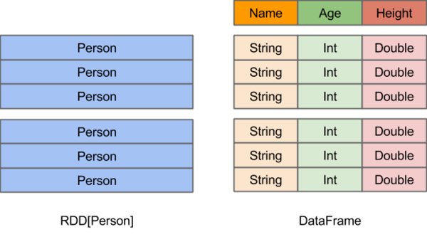

# 【Spark】RDD、DataFrame 和 DataSet

[TOC]

## 一、介绍

Spark Core 定义了 RDD、DataFrame 和 DataSet。最初只有 RDD，DataFrame 在Spark 1.3 中被首次发布，DataSet 在 Spark1.6 版本中被加入。

### 1.1、RDD

Spark 的核心概念是 RDD (resilientdistributed dataset)，指的是一个只读的，可分区的分布式数据集，这个数据集的全部或部分可以缓存在内存中，在集群中跨节点分布，在多次计算间重用。

### 1.2、DataFrame

与 RDD 相似，DataFrame 也是数据的一个不可变分布式集合。

与 RDD的主要区别在于，DataFrame 带有 schema 元信息，即 DataFrame 所表示的二维表数据集的每一列都带有名称和类型，就像关系型数据库中的表一样。

设计 DataFrame 的目的就是要让对大型数据集的处理变得更简单，它让开发者可以为分布式的数据集指定一个模式，进行更高层次的抽象。



### 1.3、Dataset

Dataset API 是对 DataFrame 的一个扩展，使得可以支持类型安全的检查，并且对类结构的对象支持程序接口。它是强类型的，不可变 collection，并映射成一个相关的 schema。

从概念上来说，可以把 DataFrame 当作一些通用对象 Dataset[Row] 的集合的一个别名，而一行就是一个通用的无类型的 JVM 对象。与之形成对比，Dataset 就是一些有明确类型定义的 JVM 对象的集合，通过在 Scala 中定义的 Case Class 或者 Java 中的 Class 来指定。

Dataset API 的核心是一个被称为 Encoder 的概念。它是负责对 JVM 的对象以及表格化的表达（tabular representation）之间的相互转化。 

在 spark2.0 后，DataFrame 的 API 和 DataSet 的 API 合并统一了，DataFrame 相当于 DataSet[Row]。现在只需要处理 DataSet 相关 API 即可。

## 二、Dataset API 的优点

在 Spark 2.0 里，DataFrame 和 Dataset 的统一 API 会为 Spark 开发者们带来许多方面的好处。

**1.静态类型与运行时类型安全**

从 SQL 的最小约束到 Dataset 的最严格约束，把静态类型和运行时安全想像成一个图谱。

比如，如果用的是 Spark SQL 的查询语句，要直到运行时才会发现有语法错误（这样做代价很大），而如果用的是 DataFrame 和 Dataset，在编译时就可以捕获错误（这样就节省了开发者的时间和整体代价）。也就是说，当在 DataFrame 中调用了 API 之外的函数时，编译器就可以发现这个错。不过，如果使用了一个不存在的字段名字，那就要到运行时才能发现错误了。

图谱的另一端是最严格的 Dataset。因为 Dataset API 都是用 lambda 函数和 JVM 类型对象表示的，所有不匹配的类型参数都可以在编译时发现。而且在使用 Dataset 时，分析错误也会在编译时被发现，这样就节省了开发者的时间和代价。

所有这些最终都被解释成关于类型安全的图谱，内容就是 Spark 代码里的语法和分析错误。在图谱中，Dataset 是最严格的一端，但对于开发者来说也是效率最高的。


**2.关于结构化和半结构化数据的高级抽象和定制视图**

把 DataFrame 当成 Dataset[Row] 的集合，就可以半结构化数据有一个结构化的定制视图。比如，假如有个非常大量的用 JSON 格式表示的物联网设备事件数据集。因为 JSON 是半结构化的格式，那它就非常适合采用 Dataset 来作为强类型化的Dataset[DeviceIoTData]的集合。

```
__Fri Sep 29 2017 10:49:26 GMT+0800 (CST)____Fri Sep 29 2017 10:49:26 GMT+0800 (CST)__{"device_id": 198164, "device_name": "sensor-pad-198164owomcJZ", "ip": "80.55.20.25", "cca2": "PL", "cca3": "POL", "cn": "Poland", "latitude": 53.080000, "longitude": 18.620000, "scale": "Celsius", "temp": 21, "humidity": 65, "battery_level": 8, "c02_level": 1408, "lcd": "red", "timestamp" :1458081226051}
__Fri Sep 29 2017 10:49:26 GMT+0800 (CST)____Fri Sep 29 2017 10:49:26 GMT+0800 (CST)__
```

可以用一个 Scala Case Class 来把每条 JSON 记录都表示为一条 DeviceIoTData，一个定制化的对象。

```scala
case class DeviceIoTData (battery_level: Long, c02_level: Long, cca2: 
String, cca3: String, cn: String, device_id: Long, device_name: String, humidity: 
Long, ip: String, latitude: Double, lcd: String, longitude: Double, scale:String, temp: Long, timestamp: Long)
```

接下来，可从一个JSON文件中读入数据。

```scala
val ds = spark.read.json(“/databricks-public-datasets/data/iot/iot_devices.json”).as[DeviceIoTData]
```

上面的代码其实可以细分为三步：

1. Spark 读入 JSON，根据模式创建出一个 DataFrame 的集合；
2. 这时，Spark 把数据用“DataFrame = Dataset[Row]”进行转换，变成一种通用行对象的集合，因为这时候它还不知道具体的类型；
3. 然后，Spark 就可以按照类 DeviceIoTData 的定义，转换出“Dataset[Row] -> Dataset[DeviceIoTData]” 这样特定类型的 Scala JVM 对象了。

将 Dataset 作为一个有类型的 Dataset[ElementType] 对象的集合，就可以非常自然地又得到编译时安全的特性，又为强类型的 JVM 对象获得定制的视图。

**3.方便易用的结构化API**

**4.性能与优化**

DataFrame 和 Dataset API 都是基于Spark SQL引擎构建的，它使用 Catalyst 来生成优化后的逻辑和物理查询计划。

所有 R、Java、Scala 或 Python 的 DataFrame/Dataset API，所有的关系型查询的底层使用的都是相同的代码优化器，因而会获得空间和速度上的效率。尽管有类型的 Dataset[T] API 是对数据处理任务优化过的，无类型的 Dataset[Row]（别名DataFrame）却运行得更快，适合交互式分析。

## 三、使用

### 3.1、在什么情况下使用 RDD？

- 希望可以对数据集进行最基本的转换、处理和控制；
- 数据是非结构化的，比如流媒体或者字符流；
- 想通过函数式编程而不是特定领域内的表达来处理数据；
- 不希望像进行列式处理一样定义一个模式，通过名字或字段来处理或访问数据属性；
- 并不在意通过 DataFrame 和 Dataset 进行结构化和半结构化数据处理所能获得的一些优化和性能上的好处；

### 3.2、在什么情况下使用 DataFrame 或 Dataset？

- 如果需要丰富的语义、高级抽象和特定领域专用的 API，那就使用DataFrame 或 Dataset；
- 如果处理需要对半结构化数据进行高级处理，如 filter、map、aggregation、average、sum、SQL 查询、列式访问或使用lambda 函数，那就使用DataFrame 或 Dataset；
- 如果想在编译时就有高度的类型安全，想要有类型的 JVM 对象，用上Catalyst 优化，并得益于 Tungsten 生成的高效代码，那就使用 Dataset；
- 如果想在不同的 Spark 库之间使用一致和简化的 API，那就使用DataFrame 或 Dataset；
- 如果是 R 语言使用者，就用DataFrame；
- 如果是 Python 语言使用者，就用 DataFrame，在需要更细致的控制时就退回去使用 RDD；

## 四、转化

### 4.1、DataFrame/Dataset 转 RDD

```scala
val rdd1=testDF.rdd
val rdd2=testDS.rdd
```

### 4.2、RDD 转 DataFrame

手动确定：

```scala
import spark.implicits._
val testDF = rdd
  .map (line=> (line._1,line._2))
  .toDF("col1","col2")
}
```

通过反射确定（利用case class 的功能）：

```scala
case class People(name:String, age:Int)
peopleRdd.map{ x =>
  val para = x.split(",")
  People(para(0),para(1).trim.toInt)
}.toDF
```

通过编程方式来确定：

```scala
// 1、准备Scheam
val schema = StructType(StructField("name", StringType) :: StructField("age", IntegerType) :: Nil)
//2、准备Data   【需要Row类型】
val data = peopleRdd.map { x =>
  val para = x.split(",")
  Row(para(0), para(1).trim.toInt)
}
//3、生成DataFrame
val dataFrame = spark.createDataFrame(data, schema)
```

### 4.3、RDD 转 Dataset

```scala
import spark.implicits._
case class People(name:String, age:Int)
peopleRDD.map{x =>
  val para = x.split(",")
  People(para(0), para(1).trim.toInt)
}.toDS
```

### 4.4、Dataset 转 DataFrame

```scala
import spark.implicits._
val testDF = testDS.toDF
```

### 4.5、DataFrame 转 Dataset

```scala
import spark.implicits._
case class People(name:String, age:Int) extends Serializable //定义字段名和类型
val testDS = testDF.as[People]
```